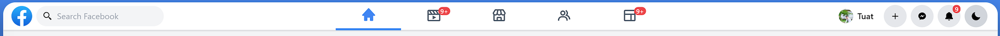
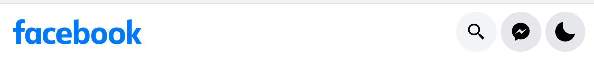
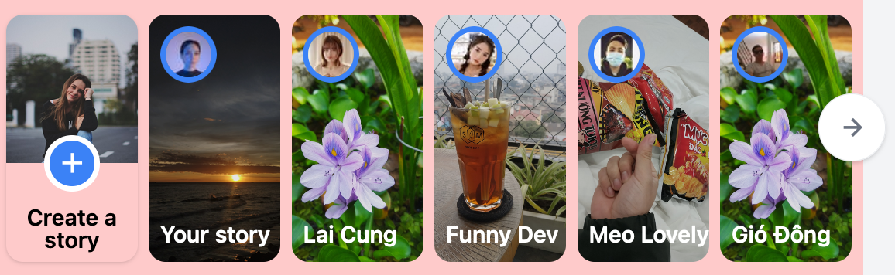
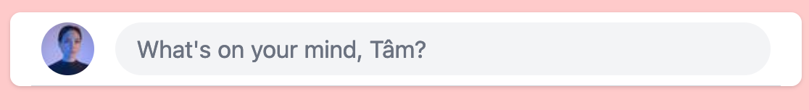
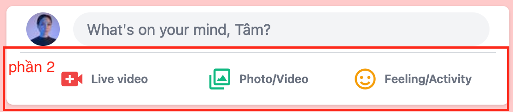
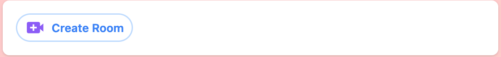
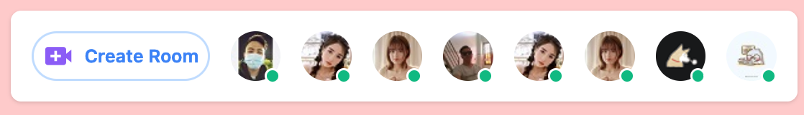
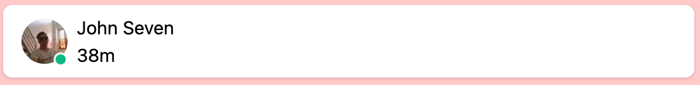
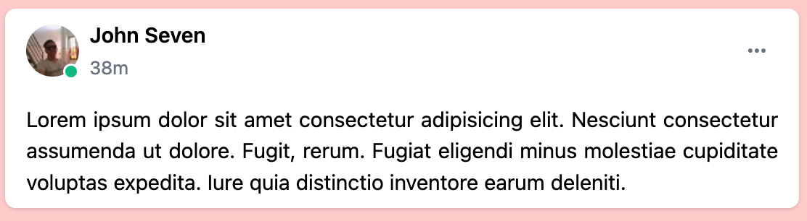

# Facebook with tailwindcss 2.1.2

Darkmode

Lightmode

Responsive

## Setup

1. Folder

```
images
static
tailwind
```

2. Bash

```
cd taildwind
npx tailwindcss-cli@latest init
```

3. Edit file tailwind.config.js

```
tailwind/tailwind.config.js
```

4. Tạo file tailwind.custom.css
   Vị trí:

```
tailwind/tailwind.custom.css
```

Nội dung

```js
@tailwind base;
@tailwind components;
@tailwind utilities;

```

5. set NODE_ENV
   terminal

```
NODE_ENV=development
```

6. build tailwind
   terminal

```
npx tailwindcss-cli@latest build tailwind.custom.css -c tailwind.config.js -o tailwind.css
```

Kết quả:

```
tailwindcss 2.1.2

   🚀 Building: tailwind.custom.css

   ✅ Finished in 4.92 s
   📦 Size: 6.75MB
   💾 Saved to tailwind.css
```

7. tạo file index.html

- favicon fb
- thư viện boxicons
- tailwind.css

```html
<title>Facebook - Tailwindcss</title>
<link rel="shortcut icon" href="./images/fb-logo.png" type="image/png" />
<link
  href="https://unpkg.com/boxicons@2.0.7/css/boxicons.min.css"
  rel="stylesheet"
/>

<link rel="stylesheet" href="./tailwind/tailwind.css" />
```

Thêm class cho body

```html
<body class="bg-gray-100 dark:bg-main-dark"></body>
```

## Phần 1: Navbar


Gồm 3 phần: Trái - Giữa - Phải

### Tạo HTML

```
nav
  // Trái
  div
    a > img[src: Facebook-logo]
    a > img[src: Facebook-logo-text]

  //Giữa
  ul
    li > a > icon home (Trang chủ)
    li > a > icon movie (Watch)
    li > a > icon store (Marketplace)
    li > a > icon group (Nhóm)
    li > a > icon layout (Trò chơi)

  //Phải
  ul
    li > a
          img[src: profile image]
          span>{Tâm}
    li > div > icon plus (Tạo)
    li > div > icon messenger (Messenger)
    li > div > icon bell (Thông báo)
    li > div > icon moon (Darkmode)
```

### Thêm class cho nav

```html
<nav
  class="
  bg-white 
  h-max w-full 
  shadow 
  flex flex-col 
  items-center justify-center 
  fixed top-0 z-50 
  border-b 
  
  md:h-14
  md:flex-row 
  md:justify-between

  dark:bg-dark-second 
  dark:border-dark-third
  "
></nav>
```

### div left con của nav

1. Thêm class cho div left

- display flex
- center các item, căn giữa

```html
<div
  class="
flex 
items-center justify-between 
w-full 
px-4 py-2

md:w-max"
></div>
```

2. Thêm class cho thẻ a con của div left

```html
<a
  href="#"
  class="
mr-2 
hidden 

md:inline-block"
></a>
```

3. Thêm class cho thẻ img con của thẻ a (hiện trên màn hình lớn)

```html

```

4. Thêm class cho thẻ a con thứ 2 của div left (hiện cho màn hình nhỏ)

```html
<a
  href="#"
  class="
inline-block 
md:hidden"
>
  
</a>
```

### input search và mobile nav (con của div left)

```html
<div
  class="
  relative 
  bg-gray-100 
  px-2 py-2 w-10 h-10  
  rounded-full 
  flex items-center justify-center 
  cursor-pointer
  
  sm:w-11 sm:h-11 
  lg:w-10 lg:h-10 
  xl:w-max xl:pl-3 xl:pr-8

  dark:border-dark-third 
  "
>
  <i
    class="bx bx-search-alt-2 
  text-xl 
  xl:mr-2 
  dark:text-dark-txt"
  ></i>
  <input
    type="text"
    placeholder="Search Facebook"
    class="outline-none bg-transparent hidden xl:inline-block"
  />
</div>
```

### nav right (mobile)



```html
<div
  class="
  text-2xl 
  bg-gray-200 

  grid place-items-center 
  rounded-full 
  w-10 h-10 
  cursor-pointer 

  hover:bg-gray-300 

  dark:bg-dark-third 
  dark-text-dark-txt

  md:hidden 
  "
>
  <i class="bx bxl-messenger"></i>
</div>
<div
  class="
  text-2xl 
  bg-gray-200 

  grid place-items-center 
  rounded-full 
  w-10 h-10 
  cursor-pointer 

  hover:bg-gray-300 

  dark:bg-dark-third 
  dark-text-dark-txt

  md:hidden 
  "
>
  <i class="bx bxs-moon"></i>
</div>
```

## Phần 2: Main center nav

### 1. class cho ul

```html

```

### 2. class cho 1 item trên menu

1 item chiếm 20% chiều rộng (khi md trở xuống)

1 item chiếm chiều rộng vừa đủ nội dung (khi md trở lên)

```html
<li class="w-1/5 md:w-max text-center"></li>
```

Nút active màu xanh

```html
<a
  href="#"
  class="
  inline-block 
  
  text-3xl 
  text-center 
  text-blue-500 
  
  w-full 
  py-2 px-3 
  border-b-4 border-blue-500
  
  cursor-pointer 

  xl:px-12 
  "
>
  <i class="bx bxs-home"></i>
</a>
```

Bình thường màu transparent khi hover thì nền màu xám

```html
  <a
    href="#"
    class="
    inline-block
    text-3xl
    text-center
    text-gray-600

    w-full
    py-2 px-3
    rounded
    cursor-pointer

    hover:bg-gray-100

    dark:hover:bg-dark-third
    dark:text-dark-txt relative

    xl:px-12
    "
  >
    <i class="bx bx-movie-play"></i>
  </a>
</li>
```

## Phần 3: Right nav

### Class cho ul

Màn hình md trở xuống sẽ ẩn

```html
<ul
  class="
mx-4 
items-center justify-center

hidden 
md:flex 
"
></ul>
```

### Class cho avatar

```html
<li class="h-full hidden xl:flex">
  <a
    href="#"
    class="
    inline-flex 
    items-center justify-center 
    
    p-1 
    mx-1
    rounded-full 
    
    hover:bg-gray-200 
    dark:hover:bg-dark-third 
    "
  >
    
    <span
      class="
    mx-2 
    font-medium 
    dark:text-dark-txt"
      >Tâm</span
    >
  </a>
</li>
```

### Class cho các item right khác (trừ thông báo và darkmode)

```html
<li>
  <div
    class="
    text-xl 
    bg-gray-200 
    
    mx-1 p-3 
    rounded-full 
    place-items-center 
    cursor-pointer 
    hidden 
    
    hover:bg-gray-300
    dark:bg-dark-third 
    dark:text-dark-txt 
    
    xl:grid 
    "
  >
    <i class="bx bxs-moon"></i>
  </div>
</li>
```

### Class cho item darkmode và thông báo

2 items này vẫn hiển thị khi màn hình nhỏ

Class cho số thông báo

```html
<li>
  <div
    class="
    relative
    text-xl 
    bg-gray-200 
    rounded-full 
    
    mx-1 p-3 
    cursor-pointer 
    
    grid 
    place-items-center 
    
    hover:bg-gray-300 
    dark:bg-dark-third 
    dark:text-dark-txt 
    "
  >
    <i class="bx bxs-bell"></i>
    <span
      class="
      absolute 
      top-0 right-0 
      px-1 
      
      text-xs 
      text-center
      text-white 
      bg-red-500 
      font-semibold 
      
      rounded-full 
      "
      >9+</span
    >
  </div>
</li>
```

### Class cho số thông báo ở item Trò chơi, và item Watch (con của main center nav)

Chỉnh vị trí right của số thông báo ở màn hình nhỏ thì right là 0; ở màn hình lớn khi mà chiều rộng của item nav lớn, thì cho right là 25%

```html
<span
  class="
  absolute 
  text-xs 
  top-0 right-1/4 
  px-1 
  
  font-semibold 
  text-white 
  bg-red-500 
  text-center 
  
  rounded-full 
  
  md:right-0
  "
  >9+</span
>
```

### Thêm icon menu khi màn hình nhỏ

Màn hình md trở lên thì ẩn icon menu, hiện icon Trò chơi

```html
<li
  class="w-1/5 md:w-max text-center 
inline-block 
md:hidden
"
>
  <a
    href="#"
    class="w-full text-3xl py-2 px-3 xl:px-12 cursor-pointer text-center inline-block rounded text-gray-600 hover:bg-gray-100 dark:hover:bg-dark-third dark:text-dark-txt relative"
  >
    <i class="bx bx-menu"></i>
  </a>
</li>
```

Màn hình md trở xuống thì hiện icon menu, ẩn icon Trò chơi

```html
<li
  class="w-1/5 md:w-max text-center 
hidden 
md:inline-block
"
></li>
```

## Phần thân

Chiếm 100% chiều cao toàn trình duyệt

Gồm 3 phần:

- Bên trái
- Giữa
- Bền phải

Bên trái:

- Mặc định ẩn, màn hình xl trở lên sẽ hiển thị
- Độ rộng: 1/5

Giữa:

- Mặc định 100% độ rộng
- Màn hình lg trở lên 2/3 độ rộng
- Màn hình xl trở lên thì 2/5 độ rộng

Phải:

- Mặc định ẩn
- Màn hình xl trở lên hiển thị
- Độ rộng: 1/5

```html
<div
  class="
flex justify-center 
h-screen
"
></div>
```

### Bên trái của phần thân

Fixed bên trái

Mặc định là ẩn, nhưng trên màn hình lớn sẽ hiển thị kiểu flex

Danh sách ul các items

```html
<div
  class="
  fixed 
  top-0 left-0 
  flex-col 
  
  w-1/5 
  h-full 
  pt-16 
  bg-blue-200
  
  hidden 
  xl:flex 
  "
></div>
```

#### li > a > img + span

Đặt class cho thẻ a:

- Hiển thị flex (để 2 item bên trong bao gồm img và span nằm ngang hàng nhau và canh giữa)
- Canh chỉnh khoảng cách
- hover đổi màu nền
- border radius
- transition
- chuẩn bị sẵn thuộc tính darkmode (đổi màu chữ và màu nền)

```html
<li>
  <a
    href="#"
    class="
    flex 
    items-center space-x-2 
    p-2 
    rounded-lg 
    transition-all 
    
    hover:bg-gray-200 
    dark:text-dark-txt 
    dark:hover:bg-dark-third
    "
  >
    
    <span class="font-semibold">Groups</span>
  </a>
</li>
```

Để hình được bo tròn, và giữ đúng tỷ lệ hình thì dùng các class:

```html
w-10 h-10 rounded-full object-cover
```

#### Class cho nút See more

Để icon chevron căn giữa có thể dùng class:

- grid
- place-items-center

```html
<span
  class="
  w-10 h-10 
  grid place-items-center 
  rounded-full 
  
  bg-gray-300 
  dark:bg-dark-second
  "
>
  <i class="bx bx-chevron-down"></i>
</span>
<span class="font-semibold">See more</span>
```

#### Css cho thanh ngang

Dùng class:

- border

```html
<div
  class="
mt-6
border-b border-gray-200 

dark:border-dark-third 
"
></div>
```

#### CSS cho phần Your Shortcuts

1. Bao gồm 2 thành phần:

- Thẻ span chữ Your shortcuts (1)
- Thẻ span chữ Edit (2)

2. Chức năng:

- Khi hover vào thẻ span (1) thì thẻ span (2) xuất hiện
- Khi hover vào thẻ span(2) thì thẻ span (2) đổi màu nền.

```html
<div
  class="
flex justify-between items-center 
px-4 h-4 
group
"
>
  <span
    class="
    font-semibold 
    text-gray-500 
    text-lg 
    
    dark:text-dark-txt 
    cursor-pointer"
    >Your shortcuts</span
  >
  <span
    class="
    p-2 
    text-blue-500 
    
    rounded-md 
    cursor-pointer 
    hidden 

    hover:bg-gray-200 
    group-hover:inline-block
    dark:hover:bg-dark-third 
    "
    >Edit</span
  >
</div>
```

#### CSS cho phần link dưới cùng của bên trái

- Dùng mt-auto để tự động đẩy phần link xuống dưới cùng của bên trái

```html
<div
  class="
mt-auto 
p-6 
text-sm 
text-gray-500 

dark:text-dark-txt 
"
>
  <a href="#">Privacy</a>
  <span>.</span>
  <a href="#">Termns</a>
  <span>.</span>
  <a href="#">Advertising</a>
  <span>.</span>
  <a href="#">Cookies</a>
  <span>.</span>
  <a href="#">Ad choices</a>
  <span>.</span>
  <a href="#">More</a>
  <span>.</span>
  <a href="#">Facebook &copy; 2021</a>
</div>
```

### Bên phải của phần thân (Friend request...)

```html
<div
  class="
  fixed 
  top-0 right-0 
  
  px-4 
  w-1/5 pt-16 
  h-full 
  bg-blue-200
  
  hidden 
  xl:block 
  "
></div>
```

#### Friend request

```
div.h-full
```

Phần 1:

2 items between 2 bên:

- Friends requests
- See All

```html
<div
  class="
flex justify-between items-center 
px-4 pt-4
"
>
  <span
    class="
  font-semibold 
  text-gray-500 
  text-lg 
  
  dark:text-dark-txt
  "
    >Friend requests</span
  >
  <span
    class="
    p-2 
    text-blue-500 
    
    rounded-md
    cursor-pointer 
    
    hover:bg-gray-200 
    dark:hover:bg-dark-third 
    "
    >See All</span
  >
</div>
```

Phần 2: Chia layout item friend request
Dùng class space-x-2 tạo khoảng cách giữa 2 nút bấm Confirm và Delete

```html
<div class="p-2">
  <a
    href="#"
    class="flex items-center space-x-4 p-2 hover:bg-gray-200 dark:hover:bg-dark-third rounded-lg transition-all"
  >
    
    <div class="flex-1 h-full">
      <div class="dark:text-dark-txt">
        <span class="font-semibold">Phương Hằng</span>
        <span class="float-right">6d</span>
      </div>
      <div class="flex space-x-2 mt-2">
        <div
          class="w-1/2 bg-blue-500 cursor-pointer py-1 text-center font-semibold text-white rounded-lg"
        >
          Confirm
        </div>
        <div
          class="w-1/2 bg-gray-300 cursor-pointer py-1 text-center font-semibold text-black rounded-lg"
        >
          Delete
        </div>
      </div>
    </div>
  </a>
</div>
```

#### Friends (Contacts)

Thẻ div bao ngoài danh sách contacts

```html
<div
  class="flex justify-between items-center px-4 pt-4 text-gray-500 dark:text-dark-txt"
></div>
```

Tiêu đề contacts

icon search

icon ...

```html
<span class="font-semibold text-lg">Contacts</span>

<div class="flex space-x-1">
  <div
    class="w-8 h-8 grid place-items-center text-sl hover:bg-gray-200 dark:hover:bg-dark-third rounded-full cursor-pointer"
  >
    <i class="bx bx-search-alt-2"></i>
  </div>
  <div
    class="w-8 h-8 grid place-items-center text-sl hover:bg-gray-200 dark:hover:bg-dark-third rounded-full cursor-pointer"
  >
    <i class="bx bx-dots-horizontal-rounded"></i>
  </div>
</div>
```

#### Friends (Danh sách bạn bè)

1. Thẻ bao ngoài ul

```html
<ul class="p-2"></ul>
```

2. Từng item:

```
li
  div (display flex)
    div (relative)
      img (avatar)
      span (absolute: chấm xanh)
    div
      span (Vũ Hùng)
```

## PHẦN MAIN

Thẻ bao lớn bên ngoài:

```html
<div
  class="
w-full 
px-2 
pt-32 
bg-red-200

lg:w-2/3 
lg:pt-16 
xl:w-2/5 
"
></div>
```

Chỉ định độ rộng của toàn bộ phần main:

- Độ rộng 100%: w-full

Cách 2 bên trái phải là

- px-2

```
padding-left: 0.5rem;
padding-right: 0.5rem;
```

Responsive ở breakpoint: 1024px;

- lg:w-2/3 (độ rộng chiếm width: 66.666667%; của thẻ cha)
- lg:pt-16 (padding-top: 1rem;)

```
@media (min-width: 1024px) { ... }
width: 66.666667%;
padding-top: 1rem;
```

Responsive ở màn hình breakpoint: 1280px;

- xl:w-2/5

```
@media (min-width: 1280px) { ... }
width: 40%;
```

## PHẦN MAIN - Create Story



### 1. Thẻ bao bên ngoài toàn bộ các item story bên trong

```html
<div class="relative flex space-x-2 pt-4"></div>
```

- relative

```
position: relative;
```

- flex và space-x-2

```css
div {
  display: flex;
  --tw-space-x-reverse: 0;
  margin-right: calc(0.5rem * var(--tw-space-x-reverse));
  margin-left: calc(0.5rem * calc(1 - var(--tw-space-x-reverse)));
}
```

- pt-4

```css
/* 1rem = 16px */
div {
  padding-top: 1rem;
}
```

### 2. Thẻ bao ngoài của 1 item

```html
<div
  class="
  w-1/4 
  h-44 
  flex flex-col 
  
  rounded-xl 
  shadow 
  group 
  overflow-hidden 
  cursor-pointer
  
  sm:w-1/6 
  "
></div>
```

1. Chỉ định chiều rộng, chiều cao và hiển thị flex theo chiều dọc

- w-1/4
- h-44
- flex flex-col

```css
div {
  /* w-1/4 */
  width: 25%;

  /* h-44 */ /* 11rem = 11 * 16px */
  height: 11rem;

  /* flex flex-col */
  display: flex;
  flex-direction: column;
}
```

2. Các style khác: bo tròn và đổ bóng

- rounded-xl
- shadow

```css
div {
  /* rounded-xl */
  border-radius: 0.75rem;
  /* shadow */
  --tw-shadow: 0 1px 3px 0 rgba(0, 0, 0, 0.1), 0 1px 2px 0 rgba(0, 0, 0, 0.06);
  box-shadow: var(--tw-ring-offset-shadow, 0 0 #0000), var(
      --tw-ring-shadow,
      0 0 #0000
    ), var(--tw-shadow);

  box-shadow: rgba(0, 0, 0, 0) 0px 0px 0px 0px, rgba(0, 0, 0, 0) 0px 0px 0px 0px,
    rgba(0, 0, 0, 0.1) 0px 1px 3px 0px, rgba(0, 0, 0, 0.06) 0px 1px 2px 0px;
}
```

3. Điểm neo cho event hover: group

4. Responsive tại breakpoint sm:w-1/6 là 640px

```css
/* sm:w-1/6  */
@media (min-width: 640px) {
  div {
    width: 16.666667%;
  }
}
```

### 3. Thẻ bao ngoài thẻ img

```html
<div class="h-3/5 overflow-hidden"></div>
```

Chỉ định chiều cao h-3/5. Và ẩn những gì nằm lọt ra ngoài thẻ bao

```css
.h-3\/5 {
  height: 60%;
}
```

### 4. Thẻ hình profile

```html

```

1. Khi hover qua thẻ có class group thì áp dụng 2 style transform và scale

```css
.group:hover .group-hover\:transform {
  --tw-translate-x: 0;
  --tw-translate-y: 0;
  --tw-rotate: 0;
  --tw-skew-x: 0;
  --tw-skew-y: 0;
  --tw-scale-x: 1;
  --tw-scale-y: 1;
  transform: translateX(var(--tw-translate-x)) translateY(var(--tw-translate-y))
    rotate(var(--tw-rotate)) skewX(var(--tw-skew-x)) skewY(var(--tw-skew-y)) scaleX(
      var(--tw-scale-x)
    )
    scaleY(var(--tw-scale-y));
}
.group:hover .group-hover\:scale-110 {
  --tw-scale-x: 1.1;
  --tw-scale-y: 1.1;
}
```

2. duration-700

```css
.duration-700 {
  transition-duration: 700ms;
}
```

3. transition-all

```css
.transition-all {
  transition-property: all;
  transition-timing-function: cubic-bezier(0.4, 0, 0.2, 1);
  transition-duration: 150ms;
}
```

### 5. Thẻ bao ngoài 2 item: Nút + và chữ Create story

```html
<div
  class="
  relative 
  flex-1 
  flex items-end justify-center 

  pb-2 
  text-center 
  leading-none 

  dark:bg-dark-second 
  dark:text-dark-txt
  "
></div>
```

1. Dàn xếp sự hiển thị của 2 thẻ con bên trong

```css
.relative {
  position: relative;
}
.flex {
  display: flex;
}
.flex-1 {
  flex: 1 1 0%;
}
.justify-center {
  justify-content: center;
}
.items-end {
  align-items: flex-end;
}
```

2. Các style về kích thước (spacing, typograpy)

```css
.pb-2 {
  padding-bottom: 0.5rem;
}
.text-center {
  text-align: center;
}
.leading-none {
  line-height: 1;
}
```

3. Các style ở darkmode (background, text color)

```css
.dark:bg-dark-second {
}
.dark:text-dark-txt {
}
```

### 6. Chữ Create Story

```html
<span class="font-semibold">
  Create a <br />
  story
</span>
```

### 7. Nút +

```html
  <div
    class="
    grid place-items-center
    w-10 h-10
    rounded-full
    bg-blue-500

    absolute
    -top-5 left-1/2
    transform -translate-x-1/2

    text-white
    text-2xl
    border-4 border-white

    dark:border-dark-second
    "
  >
    <i class="bx bx-plus"></i>
  </div>
</div>
```

1. Hình tròn và căn giữa chính nó

```css
.grid {
  display: grid;
}
.place-items-center {
  place-items: center;
}

.rounded-full {
  border-radius: 9999px;
}
/* rgb(59, 130, 246) */
.bg-blue-500 {
  --tw-bg-opacity: 1;
  background-color: rgba(59, 130, 246, var(--tw-bg-opacity));
}
```

2. Tách ra 1 layer mới, và căn giữa so với div cha

```css
.absolute {
  position: absolute;
}
.-top-5 {
  top: -1.25rem;
}
.left-1\/2 {
  left: 50%;
}
.transform {
  --tw-translate-x: 0;
  --tw-translate-y: 0;
  --tw-rotate: 0;
  --tw-skew-x: 0;
  --tw-skew-y: 0;
  --tw-scale-x: 1;
  --tw-scale-y: 1;
  transform: translateX(var(--tw-translate-x)) translateY(var(--tw-translate-y))
    rotate(var(--tw-rotate)) skewX(var(--tw-skew-x)) skewY(var(--tw-skew-y)) scaleX(
      var(--tw-scale-x)
    )
    scaleY(var(--tw-scale-y));
}
.-translate-x-1\/2 {
  --tw-translate-x: -50%;
}
```

3. Các style khác (typograpy, border)

```css
.text-white {
  --tw-text-opacity: 1;
  color: rgba(255, 255, 255, var(--tw-text-opacity));
}
.text-2xl {
  font-size: 1.5rem;
  line-height: 2rem;
}
.border-4 {
  border-width: 4px;
}
.border-white {
  --tw-border-opacity: 1;
  border-color: rgba(255, 255, 255, var(--tw-border-opacity));
}
```

4. Darkmode dark:border-dark-second (thuộc tính border)

```css
dark\:border-dark-second {
  border-color: #242526;
}
```

### 8. Thẻ bao ngoài 1 item story

```html
<div
  class="
relative 
w-1/4 
h-44 

rounded-xl 
overflow-hidden
cursor-pointer

group

sm:w-1/6 
"
></div>
```

1. Chiều rộng và chiều cao cho 1 item

- w-1/4
- h-44

```css
.w-1\/4 {
  width: 25%;
}
.h-44 {
  height: 11rem;
}
```

2. Bo tròn 4 góc và ẩn các phần dư thừa ngoài khung hình

- rounded-xl
- overflow-hidden

```css
.overflow-hidden {
  overflow: hidden;
}
.rounded-xl {
  border-radius: 0.75rem;
}
```

3. Responsive tại breakpoint 640px

- sm:w-1/6

```css
@media (min-width: 640px) {
  .sm\:w-1\/6 {
    width: 16.666667%;
  }
}
```

### 9. Thẻ img

```html

```

1. chiều cao chiều rộng chiếm full thẻ cha

2. Apply hiệu ứng khi hover vào thẻ cha bao gồm transform và scale

### 10. Thẻ div là 1 lớp phủ lên thẻ bao item tạo opacity

```html
<div
  class="
absolute 
top-0 left-0 

w-full h-full 
bg-black 
bg-opacity-10

"
></div>
```

### 11. Tên bạn bè, là 1 layer nằm lên trên thẻ cha, và được chỉ định vị trí bottom

```html
<span
  class="
absolute 
bottom-0 left-2 
pb-2 

font-semibold 
text-white
"
  >Gió Đông</span
>
```

### 12. Avatar: hình tròn nằm góc trên bên trái

```html
<div
  class="
  absolute 
  top-2 left-2 
  
  w-10 h-10 
  rounded-full 
  border-4 border-blue-500
  
  overflow-hidden 
  "
>
  
</div>
```

### 13. 2 items story cuối sẽ ẩn khi màn hình nhỏ

1. Điểm breakpoint 640px: sm:inline-block

```css
@media (min-width: 640px) {
}
```

### 14. Nút next

```html
<div
  class="
  absolute 
  -right-6 top-1/2 
  transform -translate-y-1/2 
  
  text-2xl 
  text-gray-500 
  bg-white 
  
  w-12 h-12 
  border border-gray-200 
  rounded-full 
  shadow 
  
  cursor-pointer 
  
  hover:bg-gray-100 

  hidden 
  lg:grid 
  place-items-center 
  
  dark:bg-dark-third 
  dark:border-dark-third 
  dark:text-dark-txt
  "
>
  <i class="bx bx-right-arrow-alt"></i>
</div>
```

1. Là 1 lớp layer nằm trên thẻ cha (relative)

2. Vị trí

```css
.top-1\/2 {
  top: 50%;
}
.-right-6 {
  right: -1.5rem;
}
```

3. Typography (font size, color, bg color)

4. Kích thước (w, h)

```css
.w-12 {
  width: 3rem;
}
.h-12 {
  height: 3rem;
}
```

5. Box (border, shadow)

6. Mặc định ẩn

7. Hiển thị khi màn hình từ breakpoint 1024px, và căn giữa chính nó.

8. Hiệu ứng khi hover (đổi màu background)

```css
.lg\:grid {
  display: grid;
}
.place-items-center {
  place-items: center;
}
```

9. Darkmode các thuộc tính background, border, text color

## What's on your mind: FORM

### 1. Thẻ bao ngoài cùng của form

```html
<div
  class="
px-4 mt-4 
rounded-lg 

bg-white 
shadow 

dark:bg-dark-second
"
></div>
```

1. Box model: padding theo trục x, margin top, bo góc lớn

```css
.px-4 {
  padding-left: 1rem;
  padding-right: 1rem;
}
.mt-4 {
  margin-top: 1rem;
}
.rounded-lg {
  border-radius: 0.5rem;
}
```

2. Màu nền

3. Đổ bóng

```css
.shadow {
  --tw-shadow: 0 1px 3px 0 rgba(0, 0, 0, 0.1), 0 1px 2px 0 rgba(0, 0, 0, 0.06);
  box-shadow: var(--tw-ring-offset-shadow, 0 0 #0000), var(
      --tw-ring-shadow,
      0 0 #0000
    ), var(--tw-shadow);
}
.shadow {
  box-shadow: rgba(0, 0, 0, 0) 0px 0px 0px 0px, rgba(0, 0, 0, 0) 0px 0px 0px 0px,
    rgba(0, 0, 0, 0.1) 0px 1px 3px 0px, rgba(0, 0, 0, 0.06) 0px 1px 2px 0px;
}
```

4. Darkmode: Đổi màu nền sang màu bg-dark-second

### 2. Thẻ bao phần 1



```html
<div
  class="
flex space-x-4
p-2 

border-b border-gray-300 
dark:border-dark-third 
"
></div>
```

1. Cài đặt hiển thị flex

2. Khoảng cách trục x của các item

```css
.space-x-4 {
  --tw-space-x-reverse: 0;
  margin-right: calc(1rem * var(--tw-space-x-reverse));
  margin-left: calc(1rem * calc(1 - var(--tw-space-x-reverse)));
}
/* kết quả */
.space-x-4 > :not([hidden]) ~ :not([hidden]) {
  --tw-space-x-reverse: 0;
  /* margin-left: 16px;
    margin-right: 0px*/
  margin-right: calc(1rem * var(--tw-space-x-reverse));
  margin-left: calc(1rem * calc(1 - var(--tw-space-x-reverse)));
}
```

3. Đường viền

4. Darkmod, đổi màu border

#### 1. Thẻ hình avatar

```html

```

1. Kích thước và hình tròn

2. Hình fit vừa đủ không bị bóp méo

#### 2. Dòng chữ nằm bên trong 1 thẻ div

```html
<div
  class="
  flex items-center justify-start 
  flex-1 
  pl-4 
  
  text-gray-500 text-lg 
  bg-gray-100 
  
  rounded-full 
  cursor-pointer 
  
  dark:text-dark-txt
  dark:bg-dark-third 
  "
>
  <span> What's on your mind, Tâm? </span>
</div>
```

1. Hiển thị kiểu flex, content sát bên trái, căn giữa trục y

2. Typography (màu chữ, màu nền, kích thước chữ)

3. Bo tròn thanh div

```css
.rounded-full {
  border-radius: 9999px;
}
```

4. Con trỏ chuột hình bàn tay

5. Darkmode: màu nền, màu chữ

### 3. Thẻ bao phần 2



```html
<div class="p-2 flex"></div>
```

Các item bên trong hiển thị theo flex thẻ bao này.

#### 1. Thẻ bao 1 item

```html
<div
  class="
  flex space-x-2 justify-center items-center 
  w-1/3 
  py-2 
  rounded-lg 
  
  text-xl 
  text-red-500
  
  cursor-pointer 
  hover:bg-gray-100 
  
  sm:text-3xl 
  
  dark:hover:bg-dark-third 
  "
></div>
```

1. Định kiểu hiển thị flex, khoảng cách giữa các item, căn giữa các item theo cả 2 trục x, y

2. Box model: padding theo trục y, bo tròn góc

```css
.py-2 {
  padding-top: 0.5rem;
  padding-bottom: 0.5rem;
}
.rounded-lg {
  border-radius: 0.5rem;
}
```

3. Typography: màu chữ, và kích thước

```css
.text-xl {
  font-size: 1.25rem;
  line-height: 1.75rem;
}
.text-red-500 {
  --tw-text-opacity: 1;
  color: rgba(239, 68, 68, var(--tw-text-opacity));
}
```

4. Khi hover qua thì đổi màu nền

5. Breakpoint:

```css
@media (min-width: 640px) {
  sm\:text-3xl {
    font-size: 1.875rem;
    line-height: 2.25rem;
  }
}
```

#### 2. items: icon và chữ

```html
<i class="bx bxs-video-plus"></i>
<span
  class="
font-semibold 
text-xs 
text-gray-500 

sm:text-sm 
dark:text-dark-txt
"
  >Live video</span
>
```

1. Typography: in đậm chữ, kích thước chữ, màu chữ

2. Khi màn hình breakpoint 640 trở lên thì đổi kích thước chữ

```css
@media (min-width: 640px) {
  .sm\:text-sm {
    font-size: 0.875rem;
    line-height: 1.25rem;
  }
}
```

3. Darkmode: đổi màu chữ

## Create Room

### 1. Thẻ bao ngoài cùng

```html
<div
  class="
  p-4 mt-4 
  shadow 
  rounded-lg 
  bg-white 
  
  overflow-hidden
  
  dark:bg-dark-second
  "
></div>
```

1. Khoảng cách padding và margin top

```css
.p-4 {
  padding: 1rem;
}
```

2. Đổ bóng và bo góc

3. Màu nền màu trắng

4. Ẩn những phần nằm ngoài khung nhìn

5. Darkmode: đổi màu nền

### 2. Thẻ bao ngoài quản lý flex cho tất cả item con bên trong

```html
<div class="flex space-x-4 relative"></div>
```

### 3. Thẻ bao ngoài nút create room



```html
<div
  class="
  flex 
  space-x-2 
  items-center 
  justify-center 
  
  w-1/2 
  border-2 border-blue-200 
  rounded-full 
  
  cursor-pointer
  
  lg:w-3/12 
  
  dark:border-blue-700 
  "
></div>
```

1. Các item con bên trong hiển thị flex, có khoảng cách space-x-2, căn giữa trục xy

2. Kích thước 50% nếu màn hình nhỏ

3. Nếu màn hình lớn lg (min-width:1024px) thì độ rộng chiếm 3/12

4. Đường viền và bo tròn góc

5. Darkmode: đổi màu đường viền border

#### 1. icon video plus

```html
<i
  class="
bx bxs-video-plus 
text-2xl 
text-purple-500
"
></i>
```

1. Kích thước chữ 2xl

2. Màu chữ purple-500

#### 2. Chữ Create Room

```html
<span
  class="
text-sm 
text-blue-500
font-semibold 
"
  >Create Room</span
>
```

1. Kích thước chữ -sm

2. Màu chữ -blue-500

3. Font chữ in đậm

### 4. Thẻ bao ngoài avatar bạn bè online



```html
<div class="relative cursor-pointer"></div>
```

#### 1. Hình avatar

```html

```

#### 2. Nút tròn màu xanh (online)

```html
<span
  class="
  absolute right-0 top-3/4 
  
  w-3 h-3 
  rounded-full 
  bg-green-500 
  
  border-white border-2
  "
></span>
```

1. Tạo layer mới, chỉ định vị trí

2. Độ rộng, hình tròn, màu xanh

3. Đường viền màu trắng

## New Feed

### 1. Thẻ bao ngoài

### 2. Thẻ bao ngoài Post 1

```html
<div
  class="
  mt-4 
  rounded-lg
  shadow 
  bg-white 
  
  dark:bg-dark-second dark:text-dark-txt 
  "
></div>
```

1. margin top 1rem

2. Bo tròn 4 góc 0.5rem

3. Đổ bóng

4. Nền trắng

5. Darkmode: đổi màu nền và màu chữ

### 3. Phần tác giả: Div flex bao 2 item: avatar và dấu ...



```html
<div
  class="
flex 
items-center justify-between 
px-4 py-2
"
></div>
```

1. 2 item con sẽ dàn sang 2 bên trái phải

2. Padding 2 trục xy

#### 1. Div flex bao 2 item: 1 bên là avatar và dấu tròn online, 1 bên là User name và thời gian 38m

```html
<div class="flex space-x-2 items-center"></div>
```

1. 2 bên item có khoảng cách space-x-2

2. 2 item đều canh giữa theo trục y

#### 2. Div relative bao ngoài 2 item: hình avatar và dấu tròn online

```html
<div class="relative"></div>
```

#### 3. Thẻ image

```html

```

#### 4. Dấu tròn online

```html
<span
  class="
absolute right-0 top-3/4 
w-3 h-3 

bg-green-500 
rounded-full 
border-white border-2
"
></span>
```

#### 5. Class của Username và 38m

```html
<div>
  <div class="font-semibold">John Seven</div>
  <span class="text-sm text-gray-500">38m</span>
</div>
```

#### 6. Class cho dấu ... (more)

```html
<div
  class="
  w-8 h-8 
  grid place-items-center 
  text-xl text-gray-500 
  rounded-full cursor-pointer
  
  hover:bg-gray-200 
  
  dark:text-dark-txt dark:hover:bg-dark-third 
  "
>
  <i class="bx bx-dots-horizontal-rounded"></i>
</div>
```

1. Kích thước 2rem

2. Căn giữa chính nó

3. Font chữ: 1.25rem/1.75rem

4. Bo tròn 9999px

### 4. Phần Nội dung bài post



#### 1. Nội dung bằng chữ

```html
<div class="text-justify px-4 py-2"></div>
```

```css
.text-justify {
  text-align: justify;
}
.px-4 {
  padding-left: 1rem;
  padding-right: 1rem;
}
.py-2 {
  padding-top: 0.5rem;
  padding-bottom: 0.5rem;
}
```

1. Kích thước chữ
   - Font size: 16px
   - Line height: 24px

#### 2. Nội dung bằng hình

Cảm ơn tác giả của bài hướng dẫn: https://www.youtube.com/watch?v=FzJkNtixGuQ
